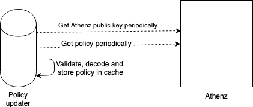

# Athenz policy updater
[](https://opensource.org/licenses/Apache-2.0) [](https://github.com/yahoojapan/athenz-policy-updater/releases/latest) [](https://circleci.com/gh/yahoojapan/athenz-policy-updater) [](https://codecov.io/gh/yahoojapan/athenz-policy-updater) [](https://goreportcard.com/report/github.com/yahoojapan/athenz-policy-updater) [](https://golangci.com/r/github.com/yahoojapan/athenz-policy-updater) [](https://www.codacy.com/app/i.can.feel.gravity/athenz-policy-updater?utm_source=github.com&amp;utm_medium=referral&amp;utm_content=yahoojapan/athenz-policy-updater&amp;utm_campaign=Badge_Grade) [](http://godoc.org/github.com/yahoojapan/athenz-policy-updater)
## What is Athenz policy updater

Athenz policy updater is a library to cache the policies of [Athenz](https://github.com/yahoo/athenz) to provider authenication and authorization check of user request.



## Usage

To initialize policy updater.

```golang

// Initialize providerd
daemon, err := providerd.New(
    providerd.AthenzURL("www.athenz.io"), // set athenz URL
    providerd.AthenzDomains("domain1", "domain2" ... "domain N"), // set athenz domains
    providerd.PubkeyRefreshDuration(time.Hour * 24), // set athenz public key refresh duration
    providerd.PolicyRefreshDuration(time.Hour), // set policy refresh duration
)
if err != nil {
   // cannot initialize policy updater daemon
}

// Start policy updater daemon
ctx := context.Background() // user can control policy updator daemon lifetime using this context
errs := daemon.StartProviderd(ctx)
go func() {
    err := <-errs
    // user should handle errors return from the daemon
}()

// Verify role token
if err := daemon.VerifyRoleToken(ctx, roleTok, act, res); err != nil {
    // token not authorizated
}
```

## How it works

To do the authentication and authorization check, the user needs to specify which [domain data](https://github.com/yahoo/athenz/blob/master/docs/data_model.md#data-model) to be cache. The policy updater will periodically refresh the policies and Athenz public key data to [verify and decode]((https://github.com/yahoo/athenz/blob/master/docs/zpu_policy_file.md#zts-signature-validation)) the domain data. The verified domain data will cache into the memory, and use for authentication and authorization check.

The policy updater contains two sub-module, Athenz pubkey daemon (pubkeyd) and Athenz policy daemon (policyd).

### Athenz pubkey daemon

Athenz pubkey daemon (pubkeyd) is responsible for periodically update the Athenz public key data from Athenz server to verify the policy data received from Athenz policy daemon and verify the role token.

### Athenz policy daemon

Athenz policy daemon (policyd) is responsible for periodically update the policy data of specified Athenz domain from Athenz server. The received policy data will be verified using the public key got from pubkeyd, and cache into memory. Whenever user requesting for the access check, the verification check will be used instead of asking Athenz server everytime.

## Configuratrion

The policy updater uses functional options pattern to initialize the instance. All the options are defined [here](./option.go).

| Option name               | Description                                                                                                         | Default Value           | Required | Example                |
|---------------------------|---------------------------------------------------------------------------------------------------------------------|-------------------------|----------|------------------------|
| AthenzURL                 | The Athenz server URL                                                                                               | "www.athenz.com/zts/v1" | No       |                        |
| AthenzDomains             | Athenz domain name of Policy cache                                                                                  |                         | Yes      | "domName1", "domName2" |
| Transport                 | The HTTP transport for getting policy data and Athenz public key data                                               | nil                     | No       |                        |
| CacheExp                  | The TTL of the success cache                                                                                        | 1 Minute                | No       |                        |
| PubkeyRefreshDuration     | The refresh duration to update the Athenz public key data                                                           | 24 Hours                | No       |                        |
| PubkeySysAuthDomain       | System authority domain name to retrieve Athenz public key data                                                     | sys.auth                | No       |                        |
| PubkeyEtagExpTime         | ETag cache TTL of Athenz public key  data                                                                           | 168 Hours (1 Week)      | No       |                        |
| PubkeyEtagFlushDur        | ETag cache purge duration                                                                                           | 84 Hours                | No       |                        |
| PolicyRefreshDuration     | The refresh duration to update Athenz policy data                                                                   | 30 Minutes              | No       |                        |
| PolicyExpireMargin        | The expire margin to update the policy data. It forces update the policy data before the policy expiration margin. | 3 Hours                 | No       |                        |
| PolicyEtagExpTime         | ETag cache TTL of policy data                                                                                       | 24 Hours                | No       |                        |
| PolicyEtagFlushDur        | Policy data cache purge duration                                                                                    | 12 Hours                | No       |                        |

## License

```markdown
Copyright (C)  2018 Yahoo Japan Corporation Athenz team.

Licensed under the Apache License, Version 2.0 (the "License");
you may not use this file except in compliance with the License.
You may obtain a copy of the License at

    http://www.apache.org/licenses/LICENSE-2.0

Unless required by applicable law or agreed to in writing, software
distributed under the License is distributed on an "AS IS" BASIS,
WITHOUT WARRANTIES OR CONDITIONS OF ANY KIND, either express or implied.
See the License for the specific language governing permissions and
limitations under the License.
```

## Contributor License Agreement

This project requires contributors to agree to a [Contributor License Agreement (CLA)](https://gist.github.com/ydnjp/3095832f100d5c3d2592).

Note that only for contributions to the garm repository on the [GitHub](https://github.com/yahoojapan/garm), the contributors of them shall be deemed to have agreed to the CLA without individual written agreements.

## Authors

- [kpango](https://github.com/kpango)
- [kevindiu](https://github.com/kevindiu)
- [TakuyaMatsu](https://github.com/TakuyaMatsu)
- [tatyano](https://github.com/tatyano)
